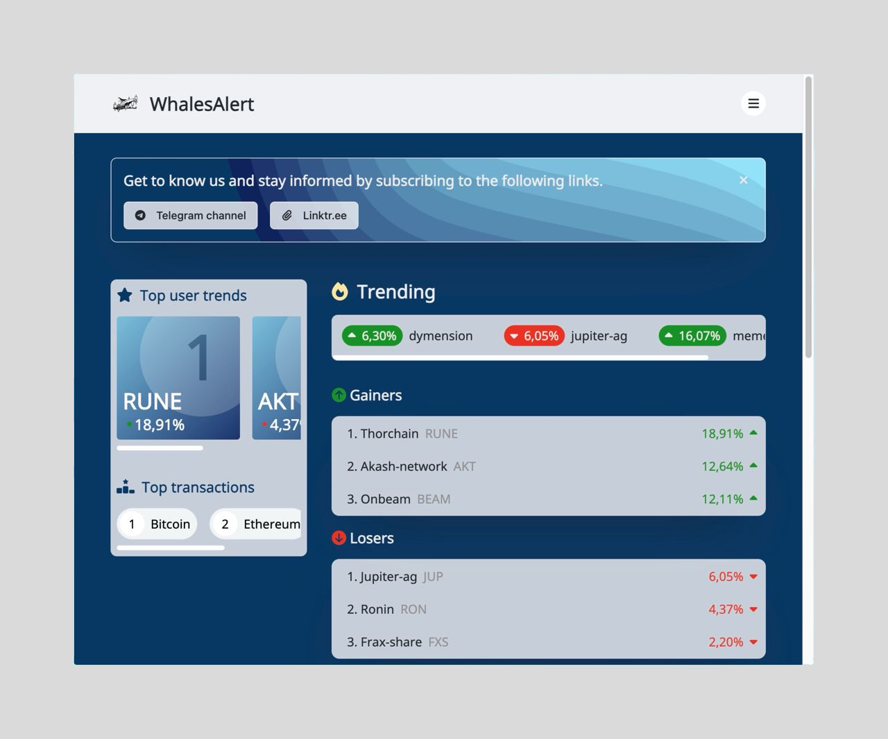

# Whales-Alert.fr

Welcome to [**Whales-Alert.fr**](https://whales-alert.fr/) - Your vigilant lookout for cryptocurrency market movements! Our service specializes in analyzing blockchain transactions, with a keen focus on low market cap cryptocurrencies. We are currently in our alpha testing phase and are excited to roll out our service to the public soon.

## Features

- **Transaction Analysis**: Immerse yourself in the market with our analysis of significant transactions across major blockchains.

- **Trend Alerts**: Keep your finger on the pulse with our trend monitoring feature, highlighting top gainers and losers.
  
  

- **Real-Time Updates**: Get notified through our dedicated Telegram channel and our array of Twitter accounts.

- **Detailed Crypto Statistics**: Gain in-depth insights into each cryptocurrency with our comprehensive statistics page.
  
  

  

## Getting Updates

- **Telegram**: Stay informed by joining our [Telegram channel](https://t.me/Whales_Alert_info).
- **X (Twitter)**: Keep up with the latest updates by following our [Twitter accounts](https://linktr.ee/whales_alert).

## Overview of Pages

### Cover Page with Trends
This section presents an overview of the current market trends, including the top user trends and the latest high-volume transactions. 

- The top portion highlights cryptocurrencies that are trending or experiencing significant volatility.
- The lower portion offers a quick view of the latest significant transactions.

### Trending Cryptocurrencies
Here we showcase the market's gainers and losers, providing insights into which cryptocurrencies are seeing the most movement.

### Crypto Statistics
Each cryptocurrency has its dedicated page, featuring:

- Statistical data such as market cap, volume, circulating supply, and price fluctuations over 1h, 24h, and 7-day periods.
- A list of recent transactions with high volume and high value.
## Feedback and Contributions

Your input is crucial to the continuous improvement of Whales-Alert.fr. If you encounter any bugs or have suggestions for new features, please feel free to add them to the 'Issues' section of this repository. 
We welcome your contributions and strive to make this service more valuable to our community. To report a bug or propose an enhancement, simply create a new issue, and we'll investigate it promptly. 
Help us refine Whales-Alert.fr and tailor it to meet your needs!

[Create an Issue](https://github.com/Charles-84/WhalesAlert_Site/issues)

Planned features include:

- **Account Management**: We'll be introducing account features that will allow users to personalize their experience.
- **Custom Alerts**: Users will be able to set up custom alerts tailored to their interests.
- **Currency Request Page**: A dedicated page for users to request the addition of new cryptocurrencies.
- **Price Evolution Graphs**: Visualize the market with graphs tracking the price movements of your favorite cryptocurrencies, providing you with actionable insights.
- **Top Search Bar**: Find the information you need quickly and easily with a top-placed search bar, designed to streamline your navigation.
- **Page Refresh Rate Customization**: Take control of how often you receive the latest data with the ability to adjust the refresh rate of the page to suit your needs.

---

Should you have any questions or require support, please reach out to [contact@whales-alert.fr](mailto:contact@whales-alert.fr).

Stay informed and stay ahead with Whales-Alert.fr!
